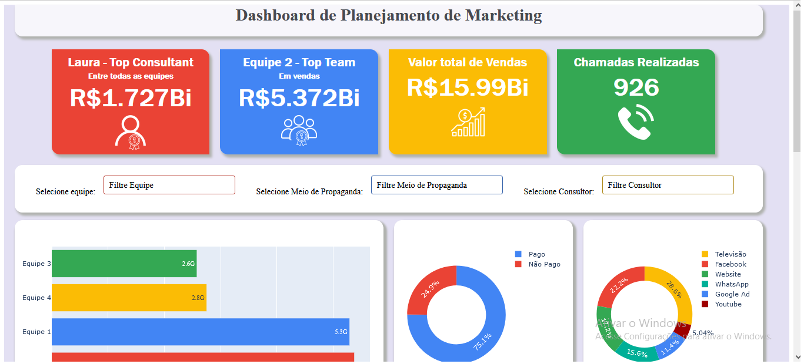
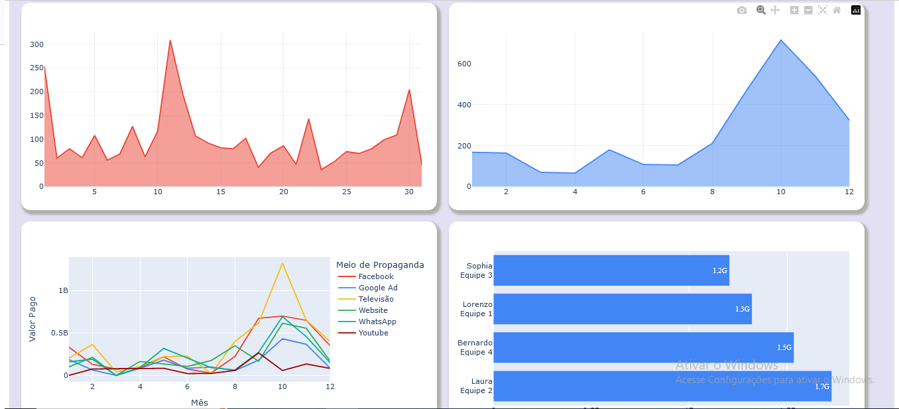
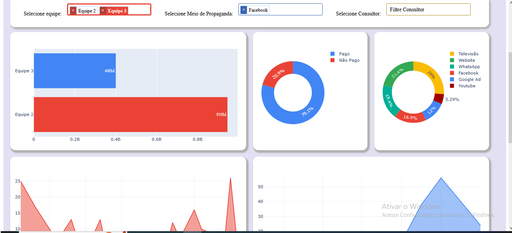
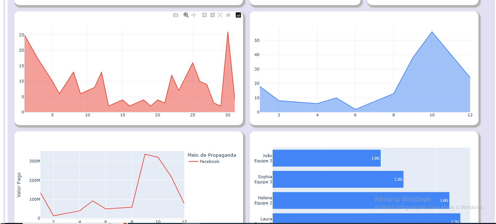
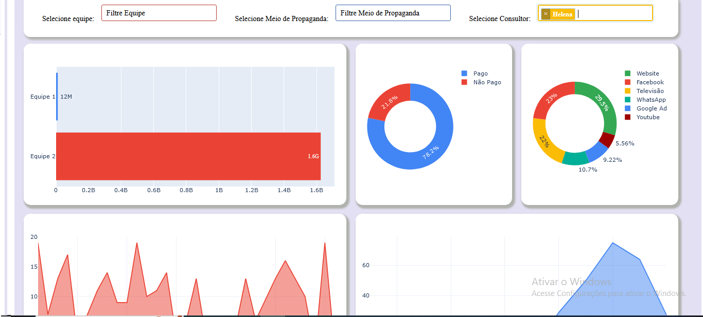
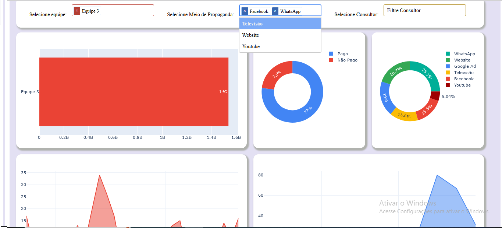

<h1 align="center"> Web Analitics - Aplicacao Web (Dash)</h1>

 
  
 
    
   

 

  
   Desenvolvimento de uma aplicação, como um dashboard disponivel online. Estruturado com pacote Dash, que é um framework da blibioteca Plotly
     baseado em Flask. O objetivo é deixar disponível sempre que necessário as informações e insights, sem que seja necessário compartilhamento de arquivos
    ou conhecimentos especificos de ferramentas, para acessar as informações.
  

  

 

 
  
 
    
    <h1 align="center">Linguagens</h1>
    
    
    
   

   

 
  
 
    <h1 align="center">Bibliotecas (Documentação no link!)</h1>
    <a href="https://plotly.com/python/">
    <a href="https://dash.plotly.com/">
      

 
  
 
    <h2 align="center">Album de Funcionalidade</h2>
    
    
   

    
  
   O design, posicionamentos, cores e até dados é maleavel de acordo com os interesses. A ideia é que seja interativo e atraente visualmente sem que haja as barreiras de um programa convencional. Existem possibilidades de inserir objetos de seccionamento dos dados como os Dropdowns ou slices, a fim de filtrar os dados em buscas. Assim como a seguir:
  
     
   

 
  
 
      
     
      
    
    
   
  
      
      
      
      

